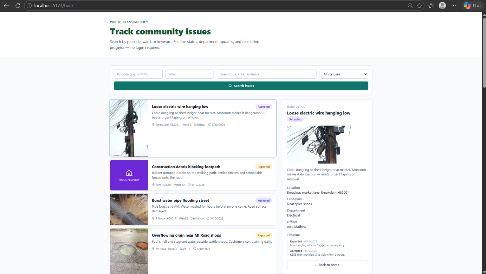
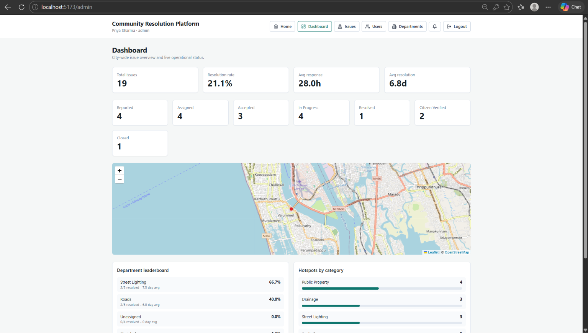

# Community Resolution Platform

> A full-stack civic technology platform for Indian municipalities — enabling citizens to **report, track, and verify** the resolution of local issues like potholes, garbage, and street lighting failures.

## Overview

Community Resolution Platform bridges the gap between citizens and municipal authorities. Citizens report civic issues with photos and location, officers get assigned and update progress, and admins oversee the entire workflow — all in real time.

## Screenshots

### Home


### Public Issue Tracker


### Live Map


### Citizen Dashboard


### Officer Workspace


### Admin Dashboard


## Key Features

|  **Public Issue Tracker** | Search by pincode, ward, or keyword — no login required |

|  **Photo Upload + AI Suggestion** | Upload photo, get auto category suggestion before submitting |

|  **6-Stage Workflow** | Reported → Assigned → Accepted → In Progress → Resolved → Verified → Closed |

|  **Live Map** | Real-time map view of all reported issues |

|  **Real-time Notifications** | Socket.io powered in-app alerts for officers and citizens |

|  **Role-Based Access** | Citizen / Officer / Admin with protected routes |

|  **India-First Location** | Address, area, ward, pincode, and landmark fields |

---

## Quick Start (Docker needed)

```bash
git clone https://github.com/harini-collab/community-resolution-platform.git
cd community-resolution-platform

copy .env.example .env

docker compose down -v
docker compose up --build -d
```

Open **http://localhost:5173**

| URL | Purpose |
|-----|---------|
| `http://localhost:5173` | Main app |
| `http://localhost:5173/track` | Public issue tracker |
| `http://localhost:5173/admin-access` | Admin login |
| `http://localhost:5000/health` | API health check |

---
## Demo Login Accounts

All demo accounts use the password: `password123`

| Role | Email |
|------|-------|
| Admin (login at /admin-access) | admin.communityresolution@gmail.com |
| Officer | rajesh.kumar.officer@gmail.com |
| Officer | arun.singh.officer@gmail.com |
| Citizen | priya.menon.citizen@gmail.com |
| Citizen | ritesh.kumar.citizen@gmail.com |

## Demo Images

Demo photos are stored in `frontend/public/demo/`, so the app does not depend on any outside image site.
If a photo is missing, the app shows a coloured category icon instead.
To reset the demo data, run:

    docker compose down -v
    docker compose up --build

##  Manual Setup (Without Docker)

**Requirements:** Node 20+, PostgreSQL 16+

```bash
npm install
psql "$DATABASE_URL" -f database/schema.sql
psql "$DATABASE_URL" -f database/seed.sql
npm run dev
```

Frontend: `http://localhost:5173` · Backend: `http://localhost:5000`

---

## Project Structure

```
community-resolution-platform/
├── backend/              # Express API + Socket.io
│   └── src/
│       ├── routes/       # auth, issues, users, officers, departments, AI
│       ├── middleware/   # auth, upload, errorHandler
│       └── utils/        # tokens, notifications, uploads
├── frontend/             # React + Vite + Tailwind CSS
│   └── src/
│       ├── pages/        # Dashboard, IssueDetail, AdminPanel, etc.
│       ├── components/   # IssueMap, Timeline, StatusBadge, etc.
│       └── context/      # AuthContext
├── database/
│   ├── schema.sql
│   ├── seed.sql
│   └── migrations/
├── docker-compose.yml
├── .env.example
└── DEPLOY.md
```

##  Tech Stack

**Frontend:** React 18, Vite, Tailwind CSS, Socket.io Client  
**Backend:** Node.js, Express, Socket.io, JWT Auth, Cloudinary  
**Database:** PostgreSQL 16  
**DevOps:** Docker, Docker Compose

---

## Team

| Name | Contribution | GitHub |
|------|-------------|--------|
| Harini | Auth System, Issue Map, Notifications, API Routes, Database Schema, Docker | [@harini-collab](https://github.com/harini-collab) |
| Srivalli | Dashboard, Officer Pages, Admin Panel, Backend Routes, Socket.io, Cloudinary | [@Srivalli-Gedela](https://github.com/Srivalli-Gedela) |

